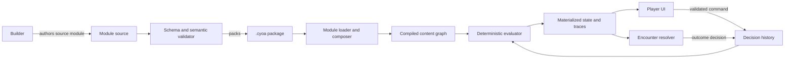

# CYOA Engine and Builder: Product and Technical Design

**Status:** Proposed architecture  
**Document version:** 0.1  
**Date:** 2026-07-11  
**Audience:** Product design, engine development, builder development, module authors, and community reviewers

## 1. Executive summary

This project should be a local-first, web-first engine for making and playing modular CYOAs that can move repeatedly between character building, narrative decisions, encounters, rewards, losses, and later character growth.

The central architectural decision is to treat a playthrough as a set of player intentions and an ordered decision history, not as a pile of overwritten variables. Every effective tag and numeric value is a projection derived from immutable definitions plus traceable contributions. Selecting, removing, equipping, rewinding, or disabling a choice changes which contributions are active; it never destroys an earlier value. This gives the engine exact undo, reliable save/load, inspectable calculations, and safe module composition.

The second central decision is that modules exchange meaning through stable, namespaced contracts. A narrative does not look for a stat whose display name happens to be “Strength.” It imports an exact contract such as `org.cyoa.core/value/strength`, declares the range or scale it expects, and can optionally use an adapter module when another creator uses a different model. Character creators, stories, rulesets, and addons are all the same package type with different declared capabilities.

The recommended product has three layers:

1. A deterministic, UI-independent TypeScript engine that loads modules, validates contracts, replays decisions, derives state, evaluates rules, and simulates encounters.
2. A player application that presents card-based character creation, story scenes, hubs, inventories, slot management, encounters, history, and calculation explanations.
3. A visual builder that edits the same data the engine runs, with a graph editor, structured condition/effect editors, a live preview, a dependency inspector, and a balance lab.

The MVP should deliberately avoid arbitrary JavaScript, arbitrary mutation of another module, real-time multiplayer, a public marketplace, and a fully general combat scripting language. Those features would weaken portability, determinism, or safety before the core interchange model is proven.

## 2. Product vision

### 2.1 The experience to enable

A creator should be able to make an experience like this without programming:

1. The player creates two party members from a nonsequential collection of ancestry, history, ability, drawback, and equipment choices.
2. The story begins. Available scenes and dialogue choices react to either party member’s tags and values.
3. A party member equips a spell into a concentration slot. A rule activates the spell’s tag and adds a derived speed modifier.
4. An encounter previews the consequences of the current build and resolves using a visible formula.
5. The result grants an injury, reward, relationship change, or resource loss with full provenance.
6. The story returns to a growth hub, where earlier and newly unlocked character options coexist.
7. A later story module can consume the same characters because both modules implement a shared contract.

### 2.2 Product principles

- **One system for builds and stories.** Character choices and narrative actions use the same conditions, effects, subjects, and trace model.
- **Modularity is semantic, not cosmetic.** Modules compose through explicit contracts, dependencies, extension points, and adapters.
- **Derived state is explainable.** Every tag, value, eligibility result, and encounter outcome can answer “why?”
- **Player intent is preserved.** When a dependency becomes invalid, an affected selection is normally suspended with an explanation rather than silently deleted.
- **Simple work is simple.** A basic card choice should require only a title, image, cost, and effects. Advanced authors can reveal rules, expressions, and contracts progressively.
- **No hidden execution.** Content packages are data. They cannot run arbitrary script, access the network, or inject unsafe markup.
- **Determinism by default.** The same module lockfile, decision history, and random seed produce the same state and outcome on every supported platform.
- **Creators own presentation; the engine owns semantics.** Themes may change layout and style, but cannot redefine how a saved decision or numeric modifier works.

### 2.3 Non-goals for the first release

- A general-purpose video game engine with animation, physics, or real-time combat.
- A replacement for prose-first scripting systems in every use case.
- Automatic semantic equivalence between independently named stats.
- Loading legacy CYOA projects with perfect behavioral parity.
- Running author-provided JavaScript or browser extensions.
- Collaborative Google-Docs-style editing.
- Server-authoritative competitive play.

## 3. Research findings and design implications

Existing interactive-fiction tools validate the value of graph-shaped content and reusable narrative primitives. Twine centers stories on passages and links; ink adds recombining flow, variables, and threads; Yarn Spinner combines nodes, options, jumps, variables, commands, and functions. This engine should retain the approachable graph but separate prose, conditions, and state effects into typed data so modules can interoperate safely.

JSON Schema Draft 2020-12 supplies a mature validation foundation for package files and supports reusable schemas. Semantic Versioning provides understandable compatibility ranges. JSON canonicalization provides stable bytes for content hashes and signatures. These should be standards at the package boundary, not inventions unique to this engine.

The state model borrows the useful part of event sourcing: record meaningful player decisions in an append-only history and derive query-friendly state from them. Full enterprise event-sourcing infrastructure would be excessive. A local save needs an ordered event list, branch cursor, periodic snapshots, and deterministic replay—not queues, distributed consistency, or a dedicated event database.

For authored logic, the relevant lesson from safe expression systems such as CEL is to compile constrained expressions once and evaluate them many times with time and memory limits. The engine should define a small typed expression AST and optional text syntax, not call JavaScript `eval`.

## 4. Terminology

| Term | Meaning |
|---|---|
| **Engine** | Pure runtime library that validates content, applies decisions, derives state, and resolves encounters. |
| **Builder** | Authoring application that creates and validates modules. |
| **Player** | Application used to load modules and play a session. |
| **Module** | Versioned content package. It may provide character creation, narrative, rules, addons, themes, or a mix. |
| **Definition** | Immutable authored description of a tag, value, choice, rule, node, slot type, or encounter profile. |
| **Subject** | Entity to which facts apply: a character, party, faction, location, world, or session. |
| **Character** | A subject with identity, control metadata, tags, values, owned options, and optional slots. PCs and NPCs share this model. |
| **Tag** | Boolean fact such as `undead`, supported by one or more active grants. |
| **Value** | Numeric fact such as `strength` or `approval`, calculated from traceable contributions. |
| **Contribution** | A source-bound grant or modifier that participates in derived state. |
| **Decision** | Player intent such as selecting a build option, assigning a slot, or taking a story action. |
| **Projection** | Current effective state calculated from definitions and decisions. |
| **Rule** | Pure, always-on conditional logic that emits derived contributions. |
| **Contract** | Namespaced semantic interface that modules provide or require. |
| **Extension point** | Explicit place where another module may add content. |
| **Adapter** | Module that deliberately translates one contract or scale into another. |
| **Session** | Loaded module set, characters, decision history, current narrative positions, and deterministic seed. |

## 5. Top-level architecture



### 5.1 Architectural boundaries

The engine core must have no dependency on React, the DOM, browser storage, or a specific desktop wrapper. It accepts plain typed data and returns results. This enables use in the browser, automated tests, a command-line validator, servers, and future alternate players.

The UI never edits projected state directly. It issues a command such as `selectChoice`, `unselectChoice`, `assignSlot`, `takeAction`, `rewind`, or `resolveEncounter`. The engine validates the command, emits one or more decision events, and calculates a new projection.

The builder runs the real engine for preview and validation. It must not implement a second approximation of conditions, values, or combat.

### 5.2 Recommended implementation shape

- Language: TypeScript with strict checking.
- Runtime: web application first; installable progressive web app; optional desktop wrapper later.
- Evaluation: isolated Web Worker in browser builds.
- Persistence: IndexedDB-backed project and session storage, with explicit file import/export.
- Package source: readable JSON plus assets in a directory.
- Published package: deterministic ZIP-compatible `.cyoa` archive.
- Numeric representation: canonical decimal strings at the file boundary and fixed-precision/arbitrary-precision decimal arithmetic inside the engine.
- UI: component-based web UI with accessible semantic HTML and theme tokens.

The exact UI library and storage wrapper can be selected during implementation without changing the file format or engine contract.

## 6. Core domain model

### 6.1 Subject model

Everything that can hold facts implements the same minimal shape:

```ts
interface Subject {
  id: QualifiedId;
  kind: "character" | "party" | "world" | "location" | "faction" | "session";
  definitionId?: QualifiedId;
  displayName: LocalizedText;
  controller: "player" | "engine" | "shared";
  ownerModuleId: ModuleId;
}
```

A character is not a special variable bag. It is a subject with optional portrait, biography fields, slot instances, and export policy. NPCs use identical tag/value evaluation, allowing rules and encounters to target them without a parallel system.

Subject selectors let content refer to concrete or contextual subjects:

- `character:hero-1`
- `role:activePlayerCharacter`
- `role:conversationPartner`
- `party:playerParty`
- `all(character where tag(...))`
- `world:current`

Selectors are resolved against an explicit scene or command context. A selector that should return one subject is an error if it returns zero or many, unless the author supplies fallback behavior.

### 6.2 Tags

A `TagDefinition` declares identity, label, description, category, applicable subject kinds, visibility, and optional interoperability contract. A tag definition does not mean a subject currently has that tag.

An active tag is supported by grants:

```ts
interface TagGrant {
  key: ContributionKey;
  subjectId: QualifiedId;
  tagId: QualifiedId;
  source: Provenance;
  active: boolean;
}
```

The effective tag is present when at least one valid active grant exists. If ancestry and equipment both grant `undead`, removing the equipment does not remove the ancestry grant. The trace lists both sources.

Tags remain boolean in version 1. Parameterized facts should normally be modeled as a tag plus values or relationships. This prevents equality and stacking rules from becoming ambiguous.

### 6.3 Values and modifiers

A `ValueDefinition` declares:

- stable qualified ID;
- display metadata and category;
- applicable subject kinds;
- unit and semantic scale;
- default value;
- precision and rounding mode;
- optional lower and upper bounds;
- visibility and formatting;
- export policy;
- optional shared contract ID.

Values are calculated from contributions, never destructively assigned. The standard pipeline is:

```text
base       = winningOverride ?? definition.default
based      = base + sum(baseAdd)
flat       = based + sum(flatAdd)
percent    = flat * (1 + sum(percentAdd))
multiplied = percent * product(multiplier)
bounded    = clamp(multiplied, minimum, maximum)
result     = round(bounded, definition.precision, definition.rounding)
```

Supported modifier operations in version 1:

| Operation | Meaning | Example |
|---|---|---|
| `baseAdd` | Adds before ordinary bonuses. | A species has +2 base strength. |
| `flatAdd` | Adds a literal or computed amount. | Gain `2 * level` speed. |
| `percentAdd` | Adds to a shared percentage bucket. `1.0` means +100%. | Haste adds +100% speed. |
| `multiplier` | Multiplies after additive percentages. | A rare curse multiplies final speed by 0.5. |
| `override` | Replaces the default base using explicit priority. | A polymorph form sets base size. |
| `minimum` / `maximum` | Adds a bound; the strictest active bound wins. | HP cannot fall below 1 in a tutorial. |

Equal-priority conflicting overrides are a validation error. Multipliers are intentionally separate from additive percentages so creators can predict stacking. Rounding occurs once, at the end, unless an expression explicitly calls a rounding function.

The user’s “+200% of level” example is a `flatAdd` whose amount expression is `value(level) * 2`. A bonus of “+200% speed” is a `percentAdd` of `2`. The builder must phrase these differently to prevent a common authoring mistake.

Every result includes a calculation trace:

```text
Speed = 42
  Default base                                      10
  Fleet ancestry (baseAdd)                          +2
  Training: 2 × Level 5 (flatAdd)                  +10
  Haste Spell (percentAdd)                        +100%
  Calculation: (10 + 2 + 10) × (1 + 1.00)          44
  Exhaustion cap (maximum)                          42
```

### 6.4 Relationships

Relationships are values or tags attached to a stable relationship subject, not hard-coded character fields. For example, `relationship/alice-to-bob` can hold `approval`, `fear`, and `romanced` facts. A helper selector can resolve relationships by endpoint roles. This keeps party, faction, reputation, and romance systems within the same evaluator.

### 6.5 Ownership versus activation

The engine distinguishes:

- **Owned option:** the character possesses a spell, item, stance, technique, or feature.
- **Assigned option:** the player has placed it into required slots.
- **Active effects:** the grants and modifiers produced because its conditions and assignments are valid.

Owning “Haste Spell” does not itself grant the `concentrating-on-haste` tag. A valid concentration assignment activates the spell’s effects. This separation is essential for inventory, attunement, equipment, hands, memorized spells, and stance systems.

## 7. Decisions, history, undo, and derived state

### 7.1 Two decision modes

`toggle` decisions model nonsequential build choices. They may be selected and unselected in any order. Their continuing effects exist only while the decision remains selected and valid.

`action` decisions model story events. Their requirements are checked when taken, and their effects remain in the active timeline even if the world later changes. The player can reverse them only by rewinding or branching the timeline, unless the author explicitly exposes a compensating action.

Both modes use the same condition and effect vocabulary.

### 7.2 Event envelope

```ts
interface DecisionEvent {
  eventId: string;
  schemaVersion: number;
  sequence: number;
  type:
    | "choice.selected"
    | "choice.unselected"
    | "action.taken"
    | "slot.assigned"
    | "slot.unassigned"
    | "encounter.resolved"
    | "timeline.branched";
  subjectId?: QualifiedId;
  definitionId: QualifiedId;
  decisionInstanceId: string;
  payload: JsonValue;
  seed?: string;
  recordedAt: string;
}
```

Events record intent—“selected Arcane Training”—rather than an opaque result—“mana changed to 15.” Effects are regenerated from the version-locked definitions. This preserves explanations and allows repaired projections. Save migrations use versioned event upcasters while retaining the original event data.

### 7.3 Recalculation sequence

For each accepted command, the engine performs an atomic transaction:

1. Load the compiled module set and previous projection.
2. Create a proposed decision event.
3. Resolve its subject/context and validate availability, costs, limits, and slot claims against a preview projection.
4. Append the event to the current timeline branch if valid.
5. Replay from the nearest compatible snapshot when a full replay is needed.
6. Materialize direct grants and modifiers from active decisions.
7. Resolve ownership and slot assignments.
8. Evaluate derived rules in dependency order.
9. Calculate effective tags, values, eligibility, visible content, and encounter previews.
10. Emit the new projection plus traces and validation messages.

Small changes should be evaluated incrementally by invalidating affected dependency nodes, but a full replay must always produce the same result and remains the correctness oracle.

### 7.4 Suspended selections

If removing one toggle invalidates another selected toggle, the dependent selection becomes `suspended`, keeps its player intent, and stops contributing effects. The UI explains the missing requirement and offers to remove it. If the requirement returns, it automatically becomes active again unless the choice definition opts into `removeWhenInvalid`.

Story actions are not retroactively suspended. Their requirements were facts at the moment the action was taken.

### 7.5 Timeline and branching

A session stores an event sequence and a branch graph. Rewind moves the active cursor to an earlier event or checkpoint. Taking a new action after rewind creates a branch; it never silently deletes the abandoned future. Creators may hide rewind in ironman-style experiences, but the underlying save remains traceable.

Snapshots cache projections after a configurable number of events or at checkpoints. They are disposable optimizations and are invalidated when the module lockfile or evaluator version changes.

## 8. Rules and expression system

### 8.1 Rule semantics

A rule is pure, declarative, and idempotent:

```ts
interface RuleDefinition {
  id: QualifiedId;
  when: Expression;
  forEach?: SubjectSelector;
  outputs: EffectTemplate[];
  presentation: "hidden" | "trace-only" | "visible";
  priority?: number;
}
```

If the condition is true, the rule emits contributions with stable keys derived from `(ruleId, subjectId, outputIndex)`. If it becomes false, those derived contributions disappear. A rule does not append events or mutate state.

Example:

```json
{
  "id": "com.example.arcana/rule/haste-speed",
  "when": {
    "op": "hasTag",
    "subject": { "ref": "self" },
    "tag": "com.example.arcana/tag/concentrating-on-haste"
  },
  "forEach": { "kind": "character", "controller": "player" },
  "outputs": [
    {
      "type": "modifyValue",
      "subject": { "ref": "self" },
      "value": "org.cyoa.core/value/speed",
      "operation": "percentAdd",
      "amount": { "literal": "1.0" }
    }
  ],
  "presentation": "visible"
}
```

### 8.2 Expressions

The canonical form is a JSON expression tree. The builder presents friendly blocks and compiles them to this AST. A future advanced text syntax may compile to the same tree.

Version 1 expression types:

- literals: boolean, canonical decimal, string, ID;
- boolean: `and`, `or`, `not`, `all`, `any`;
- comparison: `eq`, `ne`, `lt`, `lte`, `gt`, `gte`;
- arithmetic: `add`, `subtract`, `multiply`, `divide`, `min`, `max`, `clamp`, explicit `round`;
- facts: `hasTag`, `value`, `baseValue`, `countTagSources`;
- decisions: `isSelected`, `wasActionTaken`, `visitCount`;
- collections: `count`, `sum`, filtered subject selectors;
- context: current actor, target, party, node, encounter, and relationship;
- deterministic random functions only in event-resolution contexts with an explicit seed.

There are no loops, recursion, dynamic property access, I/O, clock access, network access, or user-defined executable functions. Expressions are type-checked and costed at module compile time. Runtime evaluation has node-count, collection-size, recursion-depth, and time budgets.

### 8.3 Dependencies and cycles

The compiler extracts what every condition and amount reads and what every effect writes. It builds a dependency graph covering rules, slot activation, choice validity, tags, and values.

For the MVP, derived-state cycles are rejected with a path explaining the loop. For example:

```text
Rule A writes tag:fast
  → Rule B reads tag:fast and writes value:speed
  → Rule A reads value:speed
```

This restriction makes results deterministic and understandable. A later release may support explicitly declared monotonic fixed-point rule groups, with a hard iteration limit, but general feedback loops should remain unsupported.

## 9. Slots, concentration, attunement, and equipment

### 9.1 Slot model

A slot container belongs to a subject and has a slot type, capacity, and acceptance condition:

```ts
interface SlotContainer {
  id: QualifiedId;
  ownerSubjectId: QualifiedId;
  slotTypeId: QualifiedId;
  capacity: Expression;
  accepts?: Expression;
  visibility: "public" | "private" | "hidden";
}

interface SlotClaim {
  slotTypeId: QualifiedId;
  units: number;
  group?: string;
}
```

An owned option may require multiple claims atomically. A greatsword can require two `hand` units. A magic shield can require one `hand` and one `attunement` unit. Assignment succeeds only if all claims can be satisfied.

### 9.2 Assignment behavior

- New assignments that exceed capacity are rejected with possible resolutions.
- A single command may atomically replace conflicting assignments after player confirmation.
- If capacity later shrinks, assignments are retained but suspended deterministically: lowest author priority first, then newest assignment, then stable ID as tie-breaker.
- Suspended assignments do not activate effects, but remain visible and can reactivate if capacity returns.
- The engine records the exact container IDs used, enabling two distinct hand slots or named loadout slots.
- An option can define `exclusiveGroup` to prevent multiple active forms or stances even across different slot types.

### 9.3 Haste example

1. The mage owns `Haste Spell` because a character choice granted it.
2. The spell claims one `concentration` unit.
3. The player assigns it to the mage’s concentration container.
4. Its activation effect grants `concentrating-on-haste` to the mage.
5. The always-on haste rule sees that tag and emits `speed percentAdd 1.0`.
6. Replacing Haste with another concentration spell removes only Haste’s tag grant and modifier. The owned spell remains.

## 10. Choices, scenes, and narrative flow

### 10.1 Unified choice definition

```ts
interface ChoiceDefinition {
  id: QualifiedId;
  mode: "toggle" | "action";
  title: LocalizedText;
  body?: RichText;
  image?: AssetRef;
  subject: SubjectSelector;
  visibleWhen?: Expression;
  enabledWhen?: Expression;
  limits?: ChoiceLimit[];
  costs?: EffectTemplate[];
  effects?: EffectTemplate[];
  transition?: Transition;
  repeat?: "never" | "once-per-subject" | "repeatable";
  invalidation?: "suspend" | "removeWhenInvalid";
}
```

`visibleWhen` controls discovery; `enabledWhen` controls eligibility. The player can optionally reveal hidden-choice placeholders, but not hidden text, when the creator enables accessibility hints.

Costs are ordinary negative contributions tied to a toggle or event effects tied to an action. Before acceptance, the engine simulates the candidate and checks all declared constraints. It must never briefly commit an invalid choice and then repair the value.

### 10.2 Content nodes

The narrative is a directed graph of nodes:

| Node kind | Purpose |
|---|---|
| `scene` | Prose/media followed by actions and transitions. |
| `hub` | Revisit-able location exposing multiple activities or modules. |
| `build` | Nonsequential toggle-choice board, often scoped to a character. |
| `dialogue` | Speaker-oriented scene presentation using the same actions. |
| `encounter` | Configures participants, previews, tactics, and resolution. |
| `checkpoint` | Named save/rewind boundary and optional character export point. |
| `ending` | Terminal or module-handoff state. |

All nodes contain ordered content blocks such as rich text, image, stat panel, character panel, choice group, slot panel, encounter preview, conditional block, and module extension region.

A transition may go to a fixed node, return to a hub, call a reusable subflow, hand off to an imported module entry point, or choose a destination from a typed expression. All possible static destinations appear in graph validation; dynamic destinations must declare an allowed set.

### 10.3 Recombining flow

The system should encourage hubs and gates instead of forcing a tree. Multiple paths may converge on a node. Visit counts and earlier actions are available as conditions. Reusable subflows accept typed role bindings such as actor, companion, enemy, and location, letting one conversation or encounter template serve several characters.

### 10.4 Multi-character decisions

A choice explicitly declares its subject selector. If more than one player-controlled character is eligible, the player is prompted to choose. Party-wide choices target the party subject. Effects may target actor, target, party, relationship, or world separately.

This avoids a global implicit “current character” that would make module composition fragile.

## 11. Module system and package format

### 11.1 Identity

Module IDs use reverse-domain-style ownership, for example `com.alex.starlit-road`. Definition IDs are paths under that namespace:

```text
com.alex.starlit-road/tag/moon-cursed
com.alex.starlit-road/value/lunar-charge
com.alex.starlit-road/node/act-1-crossroads
```

IDs are stable machine identity and are never localized. Renaming a display label does not change an ID. Published IDs cannot be reused for a different meaning.

### 11.2 Source layout

```text
starlit-road/
  manifest.json
  content/
    tags.json
    values.json
    characters.json
    choices.json
    rules.json
    nodes.json
    encounters.json
    extensions.json
  locales/
    en.json
  assets/
    portraits/
    scenes/
  tests/
    rules.json
    playthroughs.json
```

The builder may split large collections across more files. File layout is an authoring concern; IDs, not file paths, define references.

### 11.3 Manifest

```json
{
  "$schema": "https://schema.cyoa.example/module-manifest-1.json",
  "schemaVersion": 1,
  "id": "com.example.arcana",
  "version": "1.2.0",
  "name": "Arcana Rules",
  "capabilities": ["character", "rules", "addon"],
  "engine": ">=0.1.0 <0.3.0",
  "entryPoints": {
    "characterCreation": "com.example.arcana/node/build-mage",
    "growth": "com.example.arcana/node/mage-growth"
  },
  "dependencies": {
    "org.cyoa.core": "^1.0.0"
  },
  "optionalDependencies": {
    "com.example.fantasy-combat": "^2.0.0"
  },
  "provides": [
    { "contract": "org.cyoa.contract/character/fantasy-adventurer", "version": "1.1.0" }
  ],
  "requires": [
    { "contract": "org.cyoa.contract/value/speed", "range": "^1.0.0" }
  ],
  "extends": [
    { "module": "com.example.base-adventure", "range": "^3.1.0" }
  ],
  "permissions": {
    "externalAssets": false,
    "clipboard": false
  },
  "locales": ["en"],
  "license": "CC-BY-4.0"
}
```

The published archive also contains a generated index of file hashes. Packages are canonicalized before hashing. Optional signatures can attest publisher identity later, but signatures do not imply that content is appropriate or balanced.

### 11.4 Composition order

The loader:

1. validates each manifest and content file;
2. resolves exact versions into a lockfile;
3. rejects duplicate module IDs/versions with different hashes;
4. topologically sorts required dependencies;
5. verifies provided and required contracts;
6. registers immutable definitions;
7. applies semantic extension contributions;
8. compiles expressions and the dependency graph;
9. reports conflicts before play begins.

Ordinary contributions are designed to be order-independent. When order is meaningful, it is an explicit field such as `position: after:<qualified-id>` or numeric presentation order. Module load order must not quietly change game math.

### 11.5 Extension points and addons

Base modules publish typed extension points:

```json
{
  "id": "com.example.adventure/extension/crossroads-events",
  "accepts": ["node", "choice", "rule"],
  "visibility": "public",
  "constraints": {
    "maxContributionsPerModule": 50
  }
}
```

An addon contributes new definitions and attaches them by ID. It does not patch arbitrary JSON in the base module. Explicit override points may allow replacing a theme token, localized text, or encounter profile, but the base module defines the permitted scope and conflict policy.

Raw JSON Patch is reserved for builder migrations and repair tooling, where its sequential semantics are useful and visible. It is not the default addon mechanism because arbitrary path patches are brittle across versions and produce load-order conflicts.

## 12. Interoperability between character and narrative modules

### 12.1 Contracts, not label matching

A contract gives a concept a stable identity and documents semantics. For a numeric contract it should specify unit, scale, expected range, direction, precision, and stacking expectations. For a character contract it specifies required and optional facts and entry points.

Example contract:

```json
{
  "id": "org.cyoa.contract/value/strength-1",
  "version": "1.0.0",
  "kind": "value",
  "unit": "abstract",
  "scale": {
    "minimum": "0",
    "typical": "10",
    "exceptional": "20",
    "direction": "higher-is-more"
  }
}
```

A module may bind a local definition to that contract. Two modules using the exact contract can interoperate directly. Similar names alone never imply compatibility.

### 12.2 Character handoff

There are two supported handoff forms:

1. **Live character:** the session keeps the character-creator module loaded. The narrative reads the fully derived character, and future growth can return to creator entry points. This is preferred.
2. **Flattened character packet:** an export contains declared portable tags/values, identity fields, source lockfile, provenance summary, and contract versions. Facts become imported base contributions. This works without the creator module but cannot recalculate creator-specific rules.

The player sees whether a narrative requires the live source module or accepts a flattened packet. A packet cannot claim contracts its source did not declare.

### 12.3 Adapters

When one module uses Strength 1–20 and another uses Might 0–100, an adapter can provide an explicit mapping. The adapter declares both contracts, direction, formula, clamping, and information-loss warnings. The engine never guesses the conversion.

Adapters can also map tags, such as treating `vampire` and `lich` as sources of a broader `undead` contract. The trace shows the adapter as provenance so the player knows why the narrative reacted.

### 12.4 Compatibility report

Before play, the loader presents:

- satisfied required dependencies;
- optional integrations activated or absent;
- missing or incompatible contracts;
- adapters in use;
- extensions contributed by each addon;
- definition or ordering conflicts;
- content permissions and external assets;
- whether existing saves exactly match the resolved lockfile.

## 13. Combat and encounter framework

### 13.1 Scope

The built-in system is a deterministic two-participant duel resolver, not a complete tactical RPG. It provides a common baseline, transparent previews, author-configurable stat bindings, and swappable encounter profiles. More elaborate modules can build turn sequences from repeated encounter nodes later.

### 13.2 Default duel profile

Default semantic inputs:

- `maxHp`: positive decimal;
- `attackDamage`: nonnegative damage per hit;
- `resistance`: fraction normally clamped from 0 to 0.95;
- `attackSpeed`: positive attacks per second;
- optional `firstHitDelay`, default `1 / attackSpeed`;
- optional `minimumDamage`, default `0`.

For attacker `A` against defender `B`:

```text
damagePerHit(A→B) = max(minimumDamage, A.attackDamage × (1 - B.resistance))
hitsToDefeat(A→B) = ceil(B.maxHp / damagePerHit(A→B))
timeToDefeat(A→B) = A.firstHitDelay + (hitsToDefeat - 1) / A.attackSpeed
```

Zero effective damage produces infinite time. Both results are calculated before assigning an outcome. Lower time wins; equal times within the profile’s exact decimal tolerance are a draw, representing simultaneous final hits.

The report includes mapped input values, every intermediate calculation, time-to-defeat for both sides, and the chosen outcome. The author maps `win`, `loss`, `draw`, and optionally margin tiers to narrative transitions and effects.

### 13.3 Custom profiles

A custom profile can:

- bind different value contracts to semantic inputs;
- define derived inputs with safe expressions;
- replace the damage, hit-count, or outcome expressions;
- add a finite list of tactical choices evaluated before resolution;
- define deterministic status adjustments;
- map outcome tiers to effects and transitions.

Expressions remain pure and bounded. Arbitrary loops or author code are not allowed. A later `turn-sim.v1` profile may provide a bounded round simulator with declarative actions and a maximum turn count, but it should be a separate standardized capability.

### 13.4 Randomness

The default duel has no randomness. Profiles that use random rolls must declare them, record the seed in the resolution event, and show odds or roll traces according to creator visibility settings. Replaying the same event uses the recorded result/seed and never rerolls silently.

### 13.5 Balance lab

The builder’s encounter lab should offer:

- side-by-side participant loadouts;
- live trace and time-to-defeat;
- parameter sliders;
- batch evaluation across saved builds;
- threshold and sensitivity charts;
- detection of invulnerable, zero-speed, overflow, and guaranteed-draw states;
- outcome coverage tests.

## 14. Builder experience

### 14.1 Information architecture

The builder should have these primary workspaces:

1. **Project:** manifest, dependencies, contracts, locales, publishing.
2. **Data:** tags, values, slot types, characters, relationships, encounter profiles.
3. **Choices:** reusable choice cards, groups, costs, effects, and requirements.
4. **Story:** node graph, scene outline, reusable subflows, entry points.
5. **Rules:** structured condition/effect editor and dependency graph.
6. **Presentation:** theme tokens, content blocks, layouts, asset library.
7. **Preview:** live player with character/session controls.
8. **Test:** scenarios, assertions, coverage, compatibility, performance.
9. **Publish:** validation gate, package diff, changelog, export.

### 14.2 Progressive authoring

The default choice editor reads like a form:

```text
Title: Arcane Training
Costs: 2 Talent Points
Requires: Intelligence at least 8
Grants: Haste Spell
```

An “advanced logic” panel reveals subject selectors, expressions, contribution operations, invalidation behavior, and contracts. The saved representation is identical either way.

Templates should cover common patterns: points budget, pick N, mutually exclusive row, prerequisite chain, item/equipment, concentration spell, relationship check, skill check, hub activity, reward, injury, and default duel.

### 14.3 Graph editor

The graph view shows narrative transitions, module calls, and extension points. Filters can isolate one act, character, subflow, or condition. The outline view provides an accessible non-canvas alternative and is better for long-form editing.

Warnings include:

- unreachable nodes;
- nodes with no exit;
- dynamic transitions without declared destinations;
- entry points that cannot reach an ending or return;
- choices that are always hidden or always disabled under test fixtures;
- extension contributions targeting missing or private points.

### 14.4 Logic editor

Conditions and effects use nested readable blocks. Each reference is selected from the project symbol table, so renames update safely. The editor shows type errors immediately and can switch to a compact advanced expression view.

The dependency explorer answers:

- What can grant this tag?
- What can change this value?
- Which choices require this fact?
- What will break if this definition is removed?
- Does this rule participate in a cycle?
- Which module owns each definition?

### 14.5 Preview and debugger

The preview can:

- hot reload authored content while preserving compatible session decisions;
- switch among character and story entry points;
- impersonate subject roles;
- add test facts without polluting real content;
- step through decisions;
- inspect active, inactive, and suspended contributions;
- explain visibility and eligibility conditions;
- compare state before and after a proposed command;
- export a minimal reproduction fixture.

The value/tag “why” inspector is a first-class panel, not a developer-only console.

### 14.6 Testing in the builder

Creators can define fixtures with initial modules, characters, decisions, and assertions:

```json
{
  "name": "Haste doubles ordinary speed",
  "given": ["mage-with-speed-10", "owns-haste", "has-concentration-slot"],
  "when": ["assign-haste-to-concentration"],
  "then": [
    { "hasTag": "com.example.arcana/tag/concentrating-on-haste" },
    { "valueEquals": ["org.cyoa.core/value/speed", "20"] }
  ]
}
```

The publisher blocks on schema errors, dangling references, dependency cycles, incompatible contracts, nondeterministic tests, missing required locale strings, and unsafe assets. Less certain issues remain warnings.

## 15. Player experience

### 15.1 Session setup

The player chooses a primary module, then compatible character creators, rulesets, and addons. Recommended sets can be saved as profiles. The compatibility report appears before loading, and exact resolved versions are written to the session lockfile.

### 15.2 Main player surfaces

- Current scene or build board.
- Party/character switcher.
- Character sheet with effective and base values.
- Owned options and slot/loadout manager.
- Available activities and module entry points.
- History/checkpoints/branches.
- Calculation and requirement inspector.
- Accessibility and spoiler settings.

### 15.3 Clear state language

The UI distinguishes:

- selected and active;
- selected but suspended;
- owned but not assigned;
- assigned and active;
- visible but unavailable;
- hidden;
- committed story action;
- previewed result versus committed result.

Every unavailable state includes a human-readable reason generated from structured conditions, with an optional detailed trace.

## 16. Persistence and file types

### 16.1 Project source

Editable source is a directory or builder database with readable JSON and separate assets. Autosave maintains local recovery revisions. A portable source archive can move the project between machines.

### 16.2 Published module

`.cyoa` is a deterministic archive containing manifest, content, locales, assets, schemas used by custom contracts, file hash index, and optional signature. It contains no executable code.

### 16.3 Session save

`.cyoasave` contains:

- save schema version;
- engine compatibility version;
- exact module lockfile with hashes;
- current branch and cursor;
- decision events;
- deterministic seeds/results;
- subject identity fields allowed by export policy;
- optional disposable snapshots;
- migration history.

The save should not embed copyrighted module content by default. If required modules are unavailable, the player can inspect metadata and exported character summaries but cannot claim an exact replay.

### 16.4 Character packet

`.cyoachar` contains declared identity fields, portrait policy, portable fact snapshot, contract bindings, provenance summary, and either a required-module lock or flattened-import marker. Private/hidden facts are excluded unless the exporting module explicitly permits them and the player confirms.

## 17. Validation and diagnostics

Validation occurs at four levels:

1. **Structural:** JSON Schema, required fields, formats, and canonical numbers.
2. **Referential:** all IDs resolve, subject kinds match, entry points exist, asset paths are safe.
3. **Semantic:** expression types, value units/scales, dependency cycles, slot claims, modifier conflicts, extension permissions, contract compatibility.
4. **Behavioral:** authored tests, reachability, outcome coverage, replay determinism, performance budgets.

Every diagnostic has a stable code, severity, source file/object, plain-language message, related definitions, and suggested fix. The builder must be able to navigate directly to the responsible field.

Examples:

```text
E-RULE-CYCLE: haste-speed → speed-threshold → haste-speed
E-CONTRACT-SCALE: narrative expects strength-1 (0–20), character provides might-2 (0–100)
W-CHOICE-SUSPEND: removing Basic Magic suspends 3 currently selected options
W-COMBAT-INFINITE: both participants deal zero effective damage; encounter always draws
```

## 18. Security, trust, and privacy

Modules are untrusted input.

- Do not execute JavaScript, WebAssembly, macros, or arbitrary CSS from modules.
- Render a restricted rich-text model or sanitized Markdown; never raw unsanitized HTML.
- Resolve archive paths safely and reject traversal, absolute paths, symlinks, duplicate normalized names, and decompression bombs.
- Limit archive size, asset count, decoded image dimensions, expression size, collection fan-out, node count, and evaluation time.
- Run evaluation and asset decoding away from the main UI thread where practical.
- Use a restrictive Content Security Policy in the player and builder.
- Block external assets by default. If enabled, show domains and avoid sending session state in requests.
- Store projects and saves locally by default. Publishing or cloud sync is a separate explicit action.
- Treat signatures as identity/integrity signals, not safety approval.
- Preserve a safe mode that loads content without external assets or optional addons.

Theme packages may set documented design tokens, fonts from packaged assets, spacing, card variants, and layout presets. They cannot supply selectors or declarations that escape the player’s theme boundary.

## 19. Accessibility, localization, and content policy hooks

Accessibility is part of the content schema:

- every meaningful image supports alt text or an explicit decorative marker;
- all builder actions are keyboard accessible;
- graph content has a structured outline alternative;
- themes must pass contrast and focus checks;
- motion is optional and respects reduced-motion preferences;
- colors are never the only status indicator;
- equations and modifier traces have textual forms;
- card grids reflow without losing logical order;
- screen readers receive eligibility changes and choice outcomes predictably.

Localized text is stored behind stable message keys. Definitions may declare fallback locale and plural/select variables. Narrative logic cannot branch on translated display strings. Package validation detects missing messages and unused keys.

Modules may declare content descriptors and spoiler levels. The engine can filter discovery and require confirmation, but should not silently rewrite creator content.

## 20. Performance and determinism targets

Initial targets on a typical desktop browser:

- load and compile a 10,000-definition module set in under 2 seconds after asset metadata is available;
- apply and project a normal decision affecting fewer than 100 dependency nodes in under 16 ms in the worker;
- complete a worst-case full replay of 5,000 events in under 1 second using snapshots;
- keep ordinary projection memory under 200 MB for large community projects, excluding decoded full-resolution assets;
- virtualize card/node lists and decode images on demand;
- produce byte-identical canonical content hashes across supported platforms.

Determinism rules:

- canonical decimal arithmetic; no reliance on binary floating-point for saved results;
- stable ordering by explicit order then qualified ID;
- no wall clock in expressions;
- seeded and recorded randomness;
- exact module versions and hashes in saves;
- engine semantics version included in compiled packages and snapshots;
- deterministic conflict and suspension tie-breakers.

## 21. Testing strategy

### 21.1 Engine tests

- unit tests for every expression and modifier operation;
- property tests showing contribution removal restores the prior result regardless of removal order;
- property tests for replay determinism and snapshot equivalence;
- cycle, conflict, overflow, divide-by-zero, and limit tests;
- slot atomicity and suspension tests;
- contract and adapter conformance tests;
- combat boundary tests including simultaneous defeats and zero damage;
- fuzz tests for malformed packages, archives, expressions, and save events.

### 21.2 Integration tests

- builder output loads in the player without transformation differences;
- live preview matches a fresh published-package load;
- character creator → narrative → growth-module round trip;
- addon contribution and removal preserve base content;
- older save events upcast to current schemas;
- missing optional modules degrade as declared;
- exact package hash mismatch blocks deterministic replay with a useful recovery path.

### 21.3 Golden scenarios

Maintain a small official test suite of modules:

- point-buy character creator;
- two-character party builder;
- concentration and equipment ruleset;
- branching story with a hub and return to growth;
- base story plus two nonconflicting addons;
- conflicting addon example;
- strength-scale adapter;
- default duel and custom duel profile.

Every engine implementation must produce the same projections and traces for these fixtures.

## 22. Recommended repository structure

```text
apps/
  builder/              visual authoring application
  player/               runtime player application
packages/
  engine-core/          commands, replay, projection, tracing
  expression/           AST, parser, type checker, evaluator
  schema/               JSON Schemas and generated TypeScript types
  module-loader/        archive loading, resolution, composition
  combat/               standardized encounter profiles
  storage/              browser persistence and file adapters
  ui-kit/               accessible shared components and theme tokens
  cli/                  validate, test, pack, diff, inspect
examples/
  core-contracts/
  arcana-demo/
  crossroads-story/
  crossroads-addon/
docs/
```

The pure packages should be usable in Node-based tests and browsers. UI packages depend on engine packages, never the reverse.

## 23. Engine API sketch

```ts
interface CyoaEngine {
  compile(input: ModuleSet): CompileResult;
  createSession(compiled: CompiledModuleSet, options: SessionOptions): Session;
  preview(session: Session, command: Command): CommandPreview;
  apply(session: Session, command: Command): ApplyResult;
  replay(compiled: CompiledModuleSet, save: SessionSave): ReplayResult;
  explain(state: Projection, query: ExplainQuery): ExplanationTree;
  resolveEncounter(session: Session, request: EncounterRequest): EncounterPreview;
}

interface ApplyResult {
  accepted: boolean;
  events: DecisionEvent[];
  projection?: Projection;
  diagnostics: Diagnostic[];
  changedDependencyIds: QualifiedId[];
}
```

Commands are serializable data. `preview` and `apply` share validation; `preview` simply does not append. This makes costs, slot replacement, and encounter consequences inspectable before commitment.

## 24. Delivery roadmap

### Phase 0: Semantics prototype

Deliver a command-line/library prototype, no polished builder.

- qualified IDs and JSON Schema;
- subjects, tags, values, contributions, traces;
- toggle decisions and exact unselect/replay;
- expression AST and cycle detection;
- slots and Haste example;
- deterministic default duel;
- golden conformance fixtures.

**Exit criterion:** the same character can select options in arbitrary order, equip Haste, resolve a duel, unselect an upstream option, and reproduce all states from an event log with complete explanations.

### Phase 1: Vertical slice

- player shell;
- builder forms for definitions, choices, rules, and scenes;
- basic story graph and hubs;
- live preview/debugger;
- local persistence and source export;
- one character-creator module, one narrative module, and one addon;
- package validation and deterministic packing.

**Exit criterion:** a nontechnical creator can build and publish a short create–adventure–reward–growth loop without editing JSON.

### Phase 2: Modular alpha

- manifests, dependency resolver, lockfiles, contracts, extension points;
- live and flattened character handoff;
- adapters;
- multi-character selection and relationships;
- test authoring UI;
- theme tokens, localization, accessibility audit;
- recovery revisions and package diff.

**Exit criterion:** independently built reference modules interoperate through published contracts, and incompatible combinations fail before play with useful explanations.

### Phase 3: Community beta

- optimized incremental evaluator and snapshots;
- author documentation and template gallery;
- package signing identity support;
- compatibility/import assistant for selected legacy data;
- balance lab and batch playthrough tests;
- optional installable desktop wrapper;
- stable 1.0 file-format proposal after community review.

**Exit criterion:** large projects meet performance targets and can migrate across beta versions without losing authored content or saved decisions.

### Later possibilities

- bounded turn-based encounter profile;
- collaborative source control workflows;
- public registry/marketplace;
- cloud sync;
- mobile-focused player;
- controlled importers for Twine, ink, Yarn, or legacy CYOA data;
- standardized achievements and campaign handoffs.

## 25. Key risks and mitigations

| Risk | Impact | Mitigation |
|---|---|---|
| “Modular” content uses incompatible meanings. | Characters load but produce nonsense. | Exact contracts, documented scales, adapters, compatibility report; never match labels. |
| Rule chains become cyclic or impossible to debug. | Nondeterminism and creator frustration. | Static read/write graph, MVP cycle rejection, stable trace tree. |
| Event history adds too much complexity. | Slow development and migrations. | Use a local append-only decision list and snapshots, not distributed event infrastructure. Keep events intent-focused and versioned. |
| Addons break base modules. | Load-order bugs and abandoned saves. | Typed extension points, immutable definitions, explicit override permissions, locked versions. |
| Numeric stacking surprises players. | Balance disputes and unclear builds. | One standard pipeline, explicit modifier operation labels, full calculation trace, golden tests. |
| Visual builder becomes an expert-only IDE. | Fails the target creator audience. | Progressive disclosure, templates, form-first common cases, plain-language diagnostics. |
| Arbitrary scripting becomes a security escape hatch. | Unsafe packages and platform divergence. | Constrained AST, budgets, no code execution, worker isolation. |
| Large image-heavy projects exhaust memory. | Crashes and poor mobile use. | Separate assets, lazy decode, thumbnails, size validation, virtualization. |
| Save replay changes after module updates. | Broken campaigns. | Exact lockfile and hashes, event/schema versions, upcasters, keep compatible package versions available. |
| Hidden rules feel unfair. | Players distrust outcomes. | Creator-selectable presentation, but engine always retains a trace; player can permit full debug visibility. |

## 26. Decisions to make before implementation

These are product decisions, not blockers to the architecture:

1. **Project name and ID authority.** Decide who may publish under the shared `org.cyoa.*` namespace and how community contracts are governed.
2. **Undo policy defaults.** Recommend free undo for toggle choices and checkpoint rewind for actions, while allowing creators to restrict the UI.
3. **Hidden-information policy.** Decide whether the player can always enable full mechanical traces or whether a module may redact them until playthrough completion.
4. **Contract registry timing.** Start with packages that bundle contracts; add a network registry only after the format is stable.
5. **Legacy import scope.** Treat import as a later migration assistant, not a promise of behavioral parity.
6. **Decimal limits.** Select maximum precision and magnitude after prototype benchmarks.
7. **Licensing.** Choose licenses separately for engine source, official contracts, example content, and creator-owned modules.

## 27. MVP acceptance scenarios

The first public vertical slice is successful when all of these work:

1. A creator defines a player character, `strength`, `level`, `speed`, and tags without code.
2. A toggle choice adds `2 × level` to speed and can be removed after unrelated later choices without corrupting the original value.
3. Two independent sources grant `undead`; removing either source leaves the tag until both are gone.
4. A mage owns three concentration spells but can activate only one through a concentration slot.
5. Haste’s active tag triggers a visible rule that adds +100% speed, with an exact trace.
6. A story checks tags and values on either of two party characters and offers different actions.
7. A story reward unlocks a new growth choice, then returns the player to a build node.
8. A default duel uses the current derived stats and records a deterministic win/loss/draw event.
9. An addon contributes a new crossroads event through a published extension point without modifying the base package.
10. A separately packaged narrative consumes a live character through a shared contract.
11. Removing the addon or changing a required version produces a compatibility message, not silent state corruption.
12. Saving, reloading, and replaying produces identical state, encounter result, and explanation trees.

## 28. Recommended first implementation spike

Before building the full UI, implement one narrow end-to-end fixture called **Arcana at the Crossroads**:

- one player mage and one NPC bandit;
- values: HP, damage, resistance, speed, level, talent points;
- tags: mage, undead, concentrating-on-haste, injured;
- one concentration slot;
- three character choices, including a `2 × level` modifier;
- Haste as an owned, slottable option;
- one hidden rule and one visible rule;
- a build node, crossroads scene, duel node, reward scene, and growth node;
- a separate addon that adds an undead-only conversation choice;
- an exported live character handed to a tiny second narrative module.

Build the JSON schemas, pure evaluator, traces, decision log, and tests around this fixture. Then place a minimal builder form and player UI over the same engine. This spike exercises every risky architectural idea while keeping content small enough to reason about manually.

## 29. Sources

- [JSON Schema specification](https://json-schema.org/specification) — Draft 2020-12 validation and reusable schema foundation.
- [Semantic Versioning 2.0.0](https://semver.org/) — module and contract compatibility conventions.
- [RFC 8785: JSON Canonicalization Scheme](https://www.ietf.org/rfc/rfc8785.html) — repeatable package hashing/signing representation.
- [RFC 6902: JSON Patch](https://www.rfc-editor.org/info/rfc6902/) — sequential document patch semantics, appropriate for controlled migrations rather than routine module composition.
- [Common Expression Language overview](https://cel.dev/overview/cel-overview) — precedent for safe, portable, compile-once/evaluate-many expressions.
- [Microsoft event sourcing pattern](https://learn.microsoft.com/en-us/azure/architecture/patterns/event-sourcing) — append-only intent events, projections, snapshots, compensation, versioning, and tradeoffs.
- [ink writing documentation](https://github.com/inkle/ink/blob/master/Documentation/WritingWithInk.md) — recombining narrative flow, variables, choices, and threads.
- [Yarn Spinner scripting fundamentals](https://yarnspinner.dev/docs/yarn/02-fundamentals/) — nodes, options, jumps, variables, flow control, commands, and functions.
- [Twine passages](https://twinery.org/cookbook/introduction/passages.html) and [linking passages](https://twinery.org/reference/en/editing-stories/linking-passages.html) — graph-oriented passage and link authoring model.

---

This design intentionally makes the state/provenance model the foundation. A beautiful builder can be iterated. If state is destructively mutated or module meaning is inferred from labels, however, reliable undo and genuine cross-module play become nearly impossible to retrofit.
